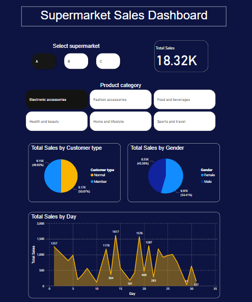
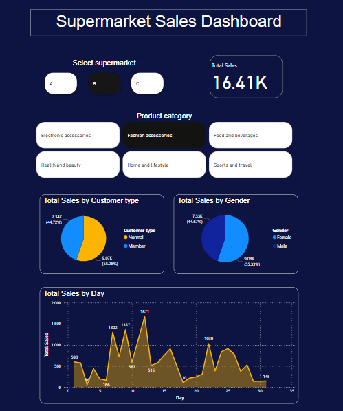

# Supermarket Sales Dashboard

## Project Overview
This project involves creating a dashboard using Power BI to help a company control and monitor the sales of its three supermarkets in a city. The dashboard provides valuable insights into sales by customer type, gender, product categories, and daily sales trends. This information can help the company make better decisions to improve their sales strategies and boost overall performance.

## Dataset
- `sales.csv`: Contains the sales data for the three supermarkets.

## Files
- `sales_dashboard.pbix`: The Power BI file used to create the dashboard.
- `screenshots`: Contains screenshots of the dashboard for quick reference.

## Dashboard 

## How to use it
1. **Select Supermarket**: Choose one of the three supermarkets (A, B, or C) to view its sales data.
2. **Select Product Category**: Filter the sales data by selecting different product categories.
3. **Analyze the Charts**: Use the pie charts to understand sales distribution by customer type and gender. Use the line chart to observe daily sales trends.
   
## Features
- **Total Sales**: Displays the total sales for the selected supermarket and product category.
- **Sales by Customer Type**: Shows the distribution of sales between normal and member customers.
- **Sales by Gender**: Provides insights into sales distribution between male and female customers.
- **Sales by Product Category**: Allows filtering sales data by different product categories like electronic accessories, fashion accessories, food and beverages, etc.
- **Sales by Day**: Shows daily sales trends to help identify peak sales days and periods of low sales.

## Conclusion
This dashboard helps the company keep track of their sales performance across different supermarkets and product categories. It provides easy-to-understand visualizations that can aid in making data-driven decisions to improve sales strategies.

